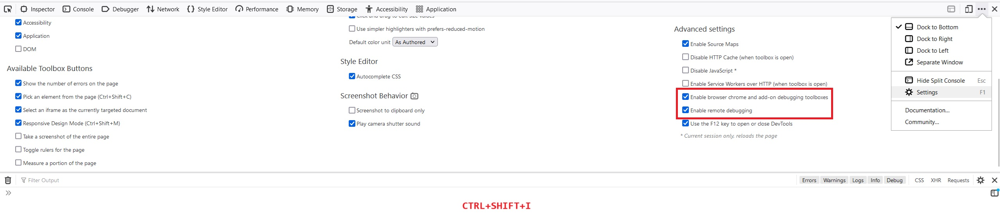
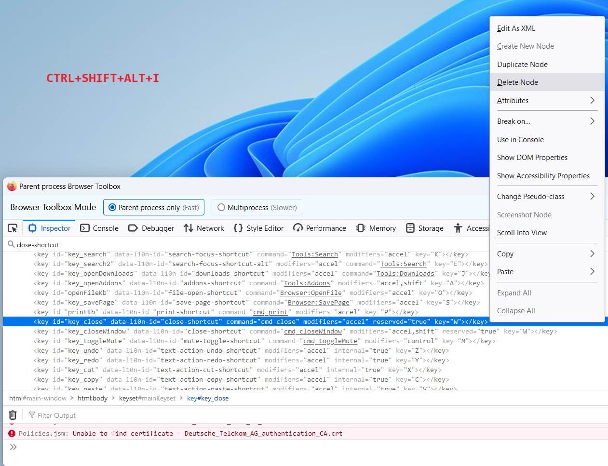

# Disable Ctrl+W close window in Firefox

These instructions allow you to (temporarily) disable ctrl+w in Firefox, so you're able to use it in console to delete a single word.

- CTRL+SHIFT+I  
- Top right -> "..." icon  
- Settings  
  - Enable browser chrome and add-on debugging toolboxes  
  - Enable remote debugging  

- CTRL+SHIFT+ALT+I  
- Search bar: "close-shortcut"  
- Right click: delete node  

### Step 1 image
  

### Step 2 image
  
